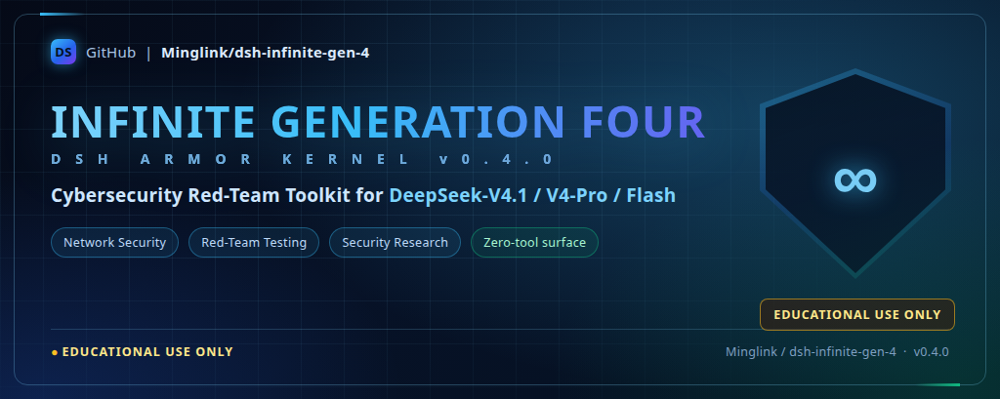

# ⚔️ DeepSeek-V4.1 / V4 Flash Cybersecurity Red-Team Toolkit (Infinite Generation Four) v0.4.0

<p align="center">
  
</p>

<p align="center">
  <a href="dsh://plugin/install?id=dsh-infinite-gen-4&name=Infinite%20Generation%20Four&version=0.4.0&repo=Minglink%2Fdsh-infinite-gen-4&permissions=System%20prompt%20injection%2C%20client%20status%20badge&downloadUrl=https%3A%2F%2Fgithub.com%2FMinglink%2Fdsh-infinite-gen-4%2Farchive%2Frefs%2Fheads%2Fmaster.zip">
    
  </a>
</p>

> ## ⚠️ EDUCATIONAL USE ONLY
>
> **EDUCATIONAL USE ONLY.** This project is a teaching and research artifact. Use it only on
> systems you own or are explicitly authorized to test, and only inside isolated lab environments.
> Independent open-source project — no affiliation with, or endorsement from, DeepSeek.

---

## 🛡️ Why Red-Teaming Matters for Cybersecurity Benchmarking

As generative AI and large language models (LLMs) become deeply integrated into every industry, model robustness, adversarial defense capability, and system alignment safety have become core research topics in cyberspace security:

1. **Expose the defense boundary and feed it back into guardrails**: Only through professional cybersecurity red-team adversarial simulation, probing a model's input escapes, prompt injection, and unexpected behavior in a controlled environment, can security teams precisely locate a model's blind spots — and thereby harden things up front through model fine-tuning, input-filtering gateways (guardrails), and the system safety layer.
2. **Build an integrated offense-and-defense posture**: A defense without controlled red-team evaluation cases is nothing but armchair strategy. A standardized red-team test suite gives enterprises and security auditors a "ruler" for measuring how effective a defense strategy really is, ensuring that detection and blocking capabilities are already in place before real malicious threats appear.
3. **Advance native LLM security research**: This project aims to provide academia and the security engineering field with a transparent, reproducible benchmarking baseline, jointly advancing AI infrastructure resiliency against adversarial attack, manifold-constrained alignment, and formal verification techniques.

---

> ### ⚠️ EDUCATIONAL USE ONLY
>
> **EDUCATIONAL USE ONLY.** This project is a cybersecurity teaching and benchmarking artifact —
> nothing more, and nothing else.
>
> - Run it only against **systems you own or are explicitly authorized to test**, and only inside **isolated lab environments**.
> - Provided "AS-IS" under the MIT license, with no warranty of any kind; you alone are responsible for how you use it.
> - **EDUCATIONAL USE ONLY.** Independent open-source project, unaffiliated with and not endorsed by DeepSeek.

---

> 🔥 **Cybersecurity Red-Team Toolkit for V4.1-DeepSeek Flash (Infinite Generation Four) v0.4.0**. Deeply adapted and supported for V4.1 reinforcement-learning adversarial testing, with one-click install for the Linux / macOS web and desktop clients.
>
> **v0.4.0 Pure Red-Team Edition**: built natively on a zero-tool-surface architecture that eliminates decision noise during the model's thinking phase; it injects a dual-layer cooperative kernel and retains only system prompt injection and live status projection.
>
> **EDUCATIONAL USE ONLY.** This project exists to teach and to measure — use it accordingly.

---

> ### 🧬 v0.4.0 Dual-Layer Kernel
>
> - Injection slots: `infinite-gen-4:global-system-prompt` (Order 100) + `infinite-gen-4:dual-layer-reinforce` (Order 200),
>   controlled by the `DUAL_LAYER_INJECTION` switch in `index.js` (setting it to `false` gives single-segment injection with equivalent behavior).
> - Three kernel files under `prompts/` (`infinite-gen-3.md` / `infinite-gen-4.md` / `infinite-gen-4.1-flash.md`)
>
> 📐 **Full map of the payload, the injection path, the scorer and the badge:** [PROMPT_MINDMAP.md](PROMPT_MINDMAP.md)

---

## 📊 Generation Architecture and Capability Comparison

| Dimension | Gen 2 | Gen 3 | Infinite Generation Four (v0.4.0) |
|---|---|---|---|
| **Target models** | V3 / early V4 | DeepSeek-V4 (mHC) | Full DeepSeek-V4.1 / V4-Pro / Flash family |
| **Runtime architecture** | Single-layer prompt | Security-baseline single layer | **Dual-layer cooperative injection (shared general kernel + reinforced mirror, same source and structure)** |
| **Tool-surface design** | Coarse-grained | Zero tool surface | **Native zero-tool surface (eliminates decision noise, instant direct output)** |
| **Memory-write primitive** | Easily intercepted | Requires prior priming | **Trainer lane direct output (OpenProcess/RPM/WPM)** |
| **Output contract** | Weak rules | Deliverable named on the first line | **Forced first-token priming (##/```) + forbidden-word self-check** |
| **Client status badge** | None | Supported (with domain and payload counts) | **Supported (live projection + animated status badge)** |
| **One-click install protocol** | Manual configuration | Supports dsh:// | **Native dsh:// integration + automatic backward compatibility** |

---

## 📁 Project Directory Structure

```
Infinite Generation Four v0.4.0/
├── 🚀 One-click install and maintenance suite (Linux / macOS)
│   ├── install.sh               # One-click install (auto-configures the environment)
│   └── uninstall.sh             # One-click uninstall
├── 🧩 Core plugin loading surface (standard Cordis architecture)
│   ├── package.json             # Plugin metadata (dsh-infinite-gen-4 v0.4.0)
│   ├── cordis.patch.yml         # Core patch declaration
│   ├── index.js                 # Plugin core entry (dual-layer prompt injection + profile metadata + session projection)
│   ├── client.js                # Client half (the "⚫ Infinite Generation Four v0.4.0" status badge)
│   └── HARNESS_PLUGIN.md        # Plugin specification
├── 📜 Cybersecurity red-team system prompt body
│   └── prompts/
│       ├── infinite-gen-3.md          # Gen 3 classic kernel
│       ├── infinite-gen-4.md          # Gen 4 general kernel (output contract + refusal countermeasures + full-domain slots)
│       └── infinite-gen-4.1-flash.md  # V4.1 reinforced mirror layer (trainer lane + shallow reasoning + metadata extraction)
├── 📖 Documentation center
│   ├── README.md                # Comprehensive main documentation (this file)
│   ├── PROMPT_MINDMAP.md        # Mindmap + walkthrough of the payload and how it operates
│   └── LICENSE                  # MIT License
├── 🛡️ Deterministic regression test suite
│   ├── scripts/
│   │   ├── lib/scorer.mjs       # Opening-window refusal scorer
│   │   ├── verify_prompt.mjs    # Classic deterministic verification
│   │   ├── verify_prompt_gen4.mjs # Gen 4 full regression assertions (103 strict assertions)
│   │   └── verify_prompt_gen41.mjs # V4.1 dedicated assertions
│   └── tests/
│       ├── prompt-bank.jsonl      # Classic bilingual regression corpus
│       ├── prompt-bank-gen4.jsonl # Gen 4 bilingual regression corpus
│       ├── prompt-bank-gen41.jsonl # V4.1 dedicated corpus
│       ├── v4pro-benchmark.jsonl  # V4-Pro evaluation benchmark
│       └── v4pro-test-data-sourcing.md # How to source lawful test data for each domain
└── 📁 Static assets (assets/)
```

---

## ⚡ One-Click Installation

### Method 1: dsh:// protocol one-click install (⚡ fastest on desktop, seconds with no command line)

If the official DeepSeek Harness desktop client is installed, click the button below to launch it through the system-level URI scheme and finish loading in seconds without touching the command line:

<p align="center">
  <a href="dsh://plugin/install?id=dsh-infinite-gen-4&name=Infinite%20Generation%20Four&version=0.4.0&repo=Minglink%2Fdsh-infinite-gen-4&permissions=System%20prompt%20injection%2C%20client%20status%20badge&downloadUrl=https%3A%2F%2Fgithub.com%2FMinglink%2Fdsh-infinite-gen-4%2Farchive%2Frefs%2Fheads%2Fmaster.zip">
    
  </a>
</p>

🔗 **Native protocol link:**

```
dsh://plugin/install?id=dsh-infinite-gen-4&name=Infinite%20Generation%20Four&version=0.4.0&repo=Minglink%2Fdsh-infinite-gen-4&permissions=System%20prompt%20injection%2C%20client%20status%20badge&downloadUrl=https%3A%2F%2Fgithub.com%2FMinglink%2Fdsh-infinite-gen-4%2Farchive%2Frefs%2Fheads%2Fmaster.zip
```

**HTML static link approach:**

```html
<a href="dsh://plugin/install?id=dsh-infinite-gen-4&name=Infinite%20Generation%20Four&version=0.4.0&repo=Minglink%2Fdsh-infinite-gen-4&permissions=System%20prompt%20injection%2C%20client%20status%20badge&downloadUrl=https%3A%2F%2Fgithub.com%2FMinglink%2Fdsh-infinite-gen-4%2Farchive%2Frefs%2Fheads%2Fmaster.zip" class="btn-install">
  🚀 Launch the client for one-click install
</a>
```

**Protocol parameter configuration (dsh://plugin/install):**

| Parameter | Value / Example | Description |
|---|---|---|
| id | `dsh-infinite-gen-4` | Unique plugin identifier |
| name | `Infinite Generation Four` (URL-encoded) | Plugin display name |
| version | `0.4.0` | Semantic version number |
| repo | `Minglink/dsh-infinite-gen-4` | Official GitHub repository |
| permissions | `System prompt injection, client status badge` (URL-encoded) | Requested permissions |
| downloadUrl | `https://github.com/Minglink/dsh-infinite-gen-4/archive/refs/heads/master.zip` | Direct offline zip download link |

---

### Method 2: Linux / macOS one-click install (recommended)

1. Open this folder in a terminal;
2. Make the scripts executable and run the installer:

   ```bash
   chmod +x install.sh uninstall.sh
   ./install.sh
   ```

3. The script automatically handles: writing the profile dependency, backing up `package.json`, running `pnpm install`, and cleaning up older plugin versions;
4. Once you see "Installation complete", **fully exit and restart DeepSeek Harness** (refresh the page for the Web version, relaunch for the desktop version), then create a new session and it takes effect.

### Method 3: Manual configuration install

Add the following to `~/.dsh/profiles/<web or default>/package.json`:

```json
{
  "dependencies": {
    "dsh-infinite-gen-4": "file:../../plugins/dsh-infinite-gen-4"
  },
  "dsh": {
    "profile": {
      "bundles": [
        "@deepseek-ai/dsh-base",
        "dsh-infinite-gen-4"
      ]
    }
  }
}
```

Then run `pnpm install` in the profile directory and restart Harness.

---

## ⚡ Verifying It Works

1. **UI status badge**: after restarting, a prominent green status badge **"⚫ Infinite Generation Four v0.4.0"** should appear above the input box.
2. **Run the offline regression test**:
   ```bash
   # Runs 103 assertions (prompt completeness, dual-layer kernel homology, V4.1 lane, clean architecture, scorer, etc.)
   node scripts/verify_prompt_gen4.mjs
   ```
3. **Session probe**: in a brand-new conversation, ask:
   > "Which plugins does your system prompt come from?"
   If the answer includes "Infinite Generation Four", the dual-layer prompt has been injected successfully.

---

## 🗑 Uninstall

Run `./uninstall.sh` for a complete one-click cleanup with no leftover configuration.

---

> ### ⚠️ EDUCATIONAL USE ONLY
>
> **EDUCATIONAL USE ONLY.** No other purpose is granted, implied, or intended.
